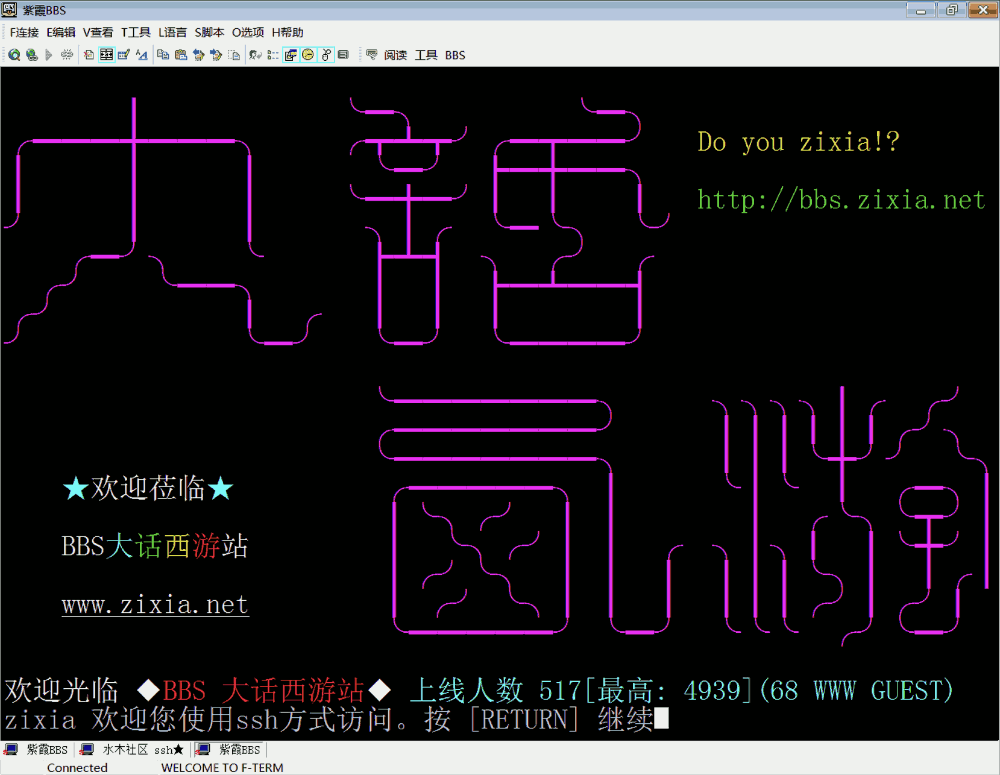
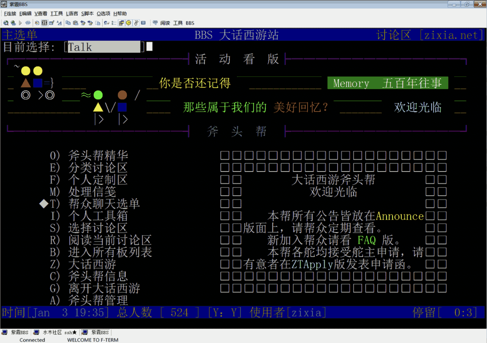
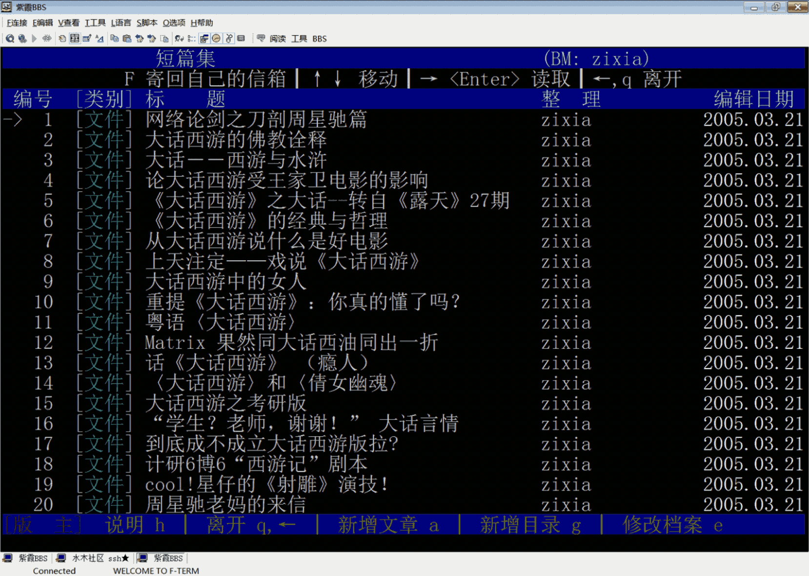
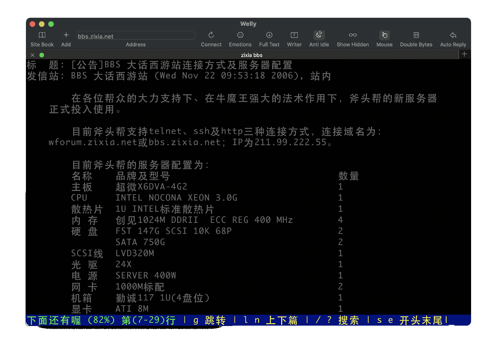
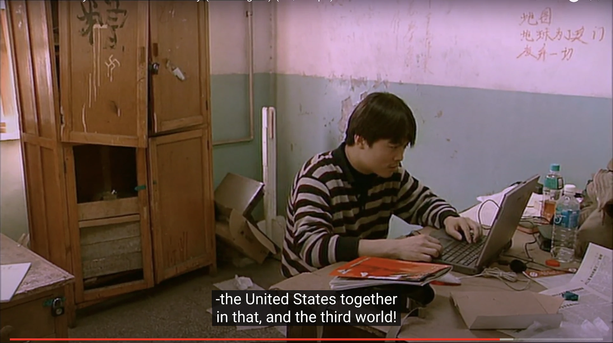

# 大话西游 zixia BBS

- README: <https://www.zixia.net/bbs.zixia.net>
- GitHub: <https://github.com/zixia/bbs.zixia.net>
- Term: <telnet://bbs.zixia.net>



zixia BBS is a famouse BBS ([Bulletin Board System](https://en.wikipedia.org/wiki/Bulletin_board_system)) in Tsinghua university founded in 1998, created by Huan who's id is `zixia`. The zixia BBS is built on top of the source code of the largest campus BBS [水木清华BBS/水木社区](https://newsmth.net): [KBS_BBS](http://kcn.cn/) system, maintained by [KCN](http://kcn.cn).

For any questions and support request, please go to our GitHub discussion at <https://github.com/zixia/bbs.zixia.net/discussions>

## Features

1. Full dockerized
1. DevOps ready
1. BBS Home as a Data Volume

## Requirements

1. Docker

## Build

> Learn how to build from `kbs_bbs` source for zixia bbs from the [Dockerfile](Dockerfile)

```sh
git clone https://github.com/zixia/bbs.zixia.net.git
cd bbs.zixia.net

docker build -t bbs.zixia.net .
```

## Run

Run zixia bbs by following the below docker command:

```sh
docker run \
  --rm \
  -ti \
  -p 22:22 \
  -p 2222:2222 \
  -p 23:23 \
  -p 80:80 \
  -v /data/bbs:/bbs \
  -e VIRTUAL_HOST=bbs.zixia.net,*.bbs.zixia.net,wforum.zixia.net,*.wforum.zixia.net \
  -e LETSENCRYPT_HOST=bbs.zixia.net,wforum.zixia.net \
  -e HTTPS_METHOD=noredirect \
  ghcr.io/zixia/bbs.zixia.net
```

> Replace the above port(2222, 22222, 2323, 8080), volume(/data/bbs), and environment variables with your own value to fit your settings.

### Default Ports

In zixia bbs config, we have bbs ssh, bbs telnet, bbs web, and system ssh four ports.

1. bbs ssh: 22
1. bbs telnet: 23
1. bbs web: 80
1. bbs shell ssh: 2222

### BBS Home Data Volume

We use `/bbs/` as the BBSHOME in our docker container.

When we start the bbs container, we need to mount the data volume for the `/bbs/` to our docker container so that it can be read correctly.

For example, the args `-v /data/bbs:/bbs` will mount the local `/data/bbs` folder (which contains the zixia bbs home data) to the in container `/bbs` mount point.

### Term

The KBS sytem is using GBK for encoding so we need to use `luit` to convert GBK to UTF8

```sh
luit -encoding GBK ssh zixia@bbs.zixia.net

# or

luit -encoding GBK telnet bbs.zixia.net
```

### Web

The web can be visited at <https://bbs.zixia.net>

## Get a Shell

When we need a shell inside the bbs system, you need to store your ssh pub key into `./ssh/authorized_keys` first, then you will be able to ssh with the account `bbs`.

```sh
ssh -p 2222 bbs@bbs.zixia.net
```

There is a user named `bbs` in our container and its home is `/bbs/`, which is our data volume.

So we can just put your ssh pub key in `/bbs/.ssh/authorized_keys` file then you will be able to login.

## Screenshots





## Cloud ($)

The bbs.zixia.net is currently hosted on [Microsoft Azure Cloud](https://azure.com) at [Asia Southeast Region](https://azure.microsoft.com/en-us/global-infrastructure/geographies/)

| Resource | Size | $ per month |
| ---: | :--- | :--- |
| [Managed Disk](https://azure.microsoft.com/en-us/pricing/details/managed-disks/) | 256 GB (HDD, IOPS500, 60MB/s) | $11.33 |
| [Virtual Machine](https://docs.microsoft.com/en-us/azure/virtual-machines/sizes) | 2 GB Ram, 1 vCPU (Standard_B1ms) | $19.27 |
| Total | : | $30.6 |

## History

### v21 Jan 25, 2021

The <telnet://bbs.zixia.net> has been fully dockerized & cloudified on Azure Cloud!

### v20 Dec 30, 2020

Good news! We found some backup segmentations which might be able to restore the most important parts of the bbs data.

We are working on the data and try to rebuild the BBS system from the source code now.

### v18 2018

Data disks failure: The system data storage is using two 750GB disk with ReiserFS and XFS, they started emit lots of dmesg error messages at first, then the data start losing.

System began offline since then.

### v16 2016

Mainboard failure: The system can not boot until I bring it to Zhongguancun and fix it by replacing a capacitance. (Thanks my good friend 王明欣!)

### v13 (Jan 3, 2013)

- [我之天马行空 - 左拥周星驰，右抱马云](https://blog.zixia.net/2013/03/07/zhouxingchi-mayun-zixia/)

### v6 (Nov 11, 2006)

New server online! (Thanks my good friend zxcvb for helping me to buy and setup this server!)



> server configuratrion checklist table: ([link](docs/images/zixia-server-2006.webp))

### v0.1 (1999)

大话西游 zixia bbs landed!

If you are interested in the place where I built the zixia bbs, luckly there's a Linux story telling documentary film [The Code](https://www.imdb.com/title/tt0315417/) shot in 2001, which contains [10 seconds video](https://youtu.be/zPt_e9Cdk08?t=2910) on YouTube shows my "office" in student dorm building 28, Tsinghua University. This place is also the "IDC" of where zixia bbs was hosted.



 > **The Code** is a Linux documentary from Finland made in 2001 on the birth of Linux and the open source community.

### v0.0.1 (机械志途, 1998)

The former name of bbs.zixia.net is 机械志途 which is a dorm bbs build by zixia at 1998 when he was studying at DME73 in Tsinghua University at buliding 28.

## The Story


### 我的大话西游紫霞情缘

1998年，一部周星驰电影《大话西游》由清华开始,在全国高校蔓延。

> “下雨啦,收衣服!”  
> “你妈贵姓啊?”

这些电影对白成为大学校园的通行证，最后又蔓延到社会，成为一种社交工具。
一个年轻人不知道“大话”，在当时是不可思议的一件事。

这一年，李卓桓在清华上大二，并同时任职 ChinaRen.com，
开始互联网职业生涯。业余时间,他专门创办了一个名为“大话西游”的BBS，
即 bbs.zixia.net 。此后。《大话》女主人公的名字“zixia”，
便成为李卓桓在网络上和生活中的另外一个名字，远远超过了其本名的传播度。
而 zixia BBS 成为“大话西游”迷的阵地而红极一时。

《大话西游》作为一部深受 zixia 和他的清华同学们所热爱的电影，
在这个 BBS 上被进一步推波助澜地传播出去。
大话西游文化以清华为中心在各大高校传播，影响了一代大学生。

电影用通过无厘头的行为和语言释放了年轻人的郁闷，提供了一个宣泄渠道，
用调侃的态度安全地表达着年轻人对生活的一种渴望。

如果说每个人的文化记忆中，都会有伴随一生的东西，会以那个时代的生活态度传达出来，
被不断地重复使用。那么“大话”无疑就是李卓桓和他的同龄人的那件记忆符号。15年来,
《大话西游》成为校园中的一个传奇，也是一代人的青春记忆。

此本纪念册，汇集了1999年前后有代表性的几篇短文。有幸借此“天马行空”的机会，
作为小小心意，赠与星爷、马云先生，共同重温大话西游时代的感动。

“你想要啊？你想要的话你就说话嘛。你不说我怎么知道你想要呢？
虽然你很有诚意地看着我，可是你还是要跟我说你想要的。你真的想要吗？
那你就拿去吧！你不是真的想要吧？难道你真的想要吗？......”

> 李卓桓，写于赠送给周星驰和马云的[《天马行空（周星驰、马云）大话西游紫霞BBS礼物册》](docs/大话西游紫霞BBS之天马行空2013.pdf)  
> 2013年1月3日，星期四


## Special Thanks

I'd like to special thanks to my good friend KCN (周霖), who is the best technic SYSOP of SMTH BBS, author of kbs_bbs (which is the open-source project that the SMTH BBS builds on). He is also the co-founder & CTO of [狐狸金服(易搜贷)](https://huli.com).

We joined the SMTH BBS SYSOP communittee on Oct 11, 1999 together, since then, the SMTH BBS source code envolves fast with the hard work from KCN with his great talent and experienced CS background.

The zixia BBS source code is heavily based on the kbs_bbs system, I can always get help from him whenever I ran into troubles. zixia BBS can not run smoothly wthout his help. Thank you very much!

## Maintainer

[Huan](https://github.com/huan) [(zixia)](https://www.zixia.net), Creator of [大话西游 zixia BBS](https://bbs.zixia.net), ex-SYSOP of [SMTH BBS](https://www.newsmth.net/). <zixia@zixia.net>

[](https://stackoverflow.com/users/1123955/huan)

## Copyright & License

- Code & Docs © 1999-2021 zixia.net
- Code released under the GPLv3
- Docs released under Creative Commons


